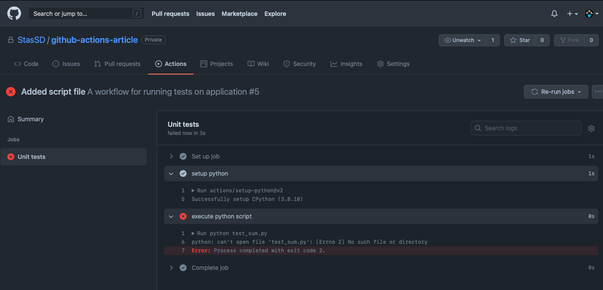
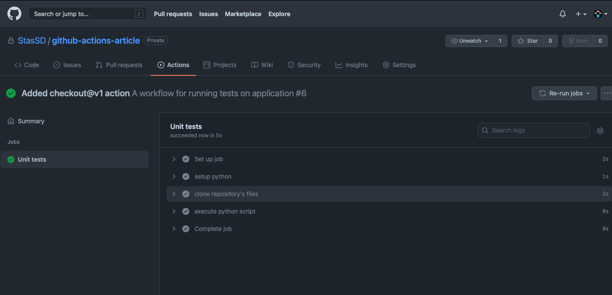
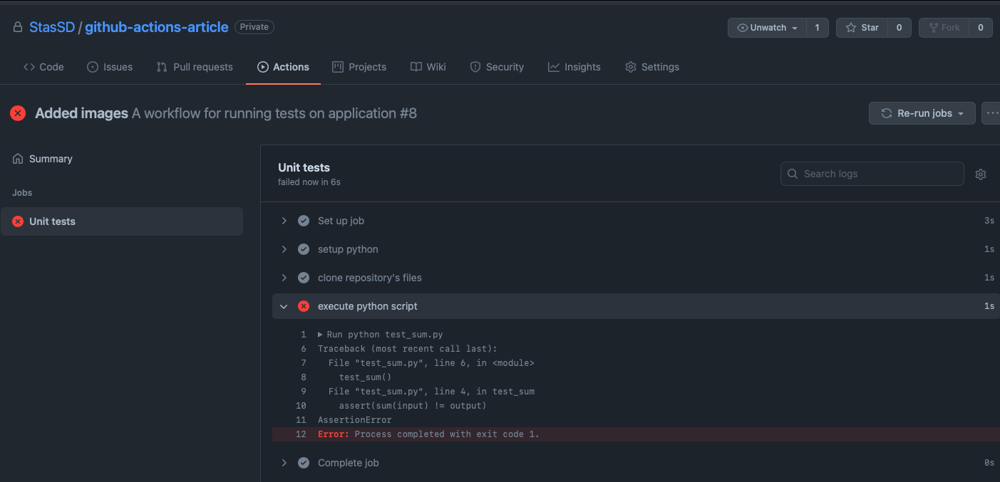

# About

The purpose of this article is to provide a handy and quick reference to general usage of **GitHub actions**, what it is and how one could implement them in their own project, as well as writing your own actions and customizing them. The customization will be illustrated by a simple example where we will automate testing in simple python script.

# Table of contents
* What are GitHub actions?
* How to implement your own workflow
* Where to look for references

## What are GitHub actions?

Even if you are experienced git user who knows tons of git workflows and best practices, you still might not even heard of some amazing features the GitHub platform itself has to offer. GitHub action is one such thing.

Basically **GitHub actions** is a feature which allows to configure your GH repository to automatically do some stuff depending on how you configure it. You write a few configuration files with commands specifying the settings for a remote machine that will run your application. You can also tell github to automatically do launch some stuff on a remote machine whenever some event happens, for instance, imagine you have some tests in your repository and you want every commit from your collaborators to pass the tests. You can tell github to run those tests whenever someone pushes to the repository.

By navigation to `actions` tab in your github repository you will see the following:


We will now move on to writing your own workflow.

## How to implement your own workflow

A workflow in github actions is basically a list of commands that you write to set up the remote machine on github to run in the way you want to. 


1) First, we create a `.github/workflows` directory in our git repository. You can do it in github or in your local repository, and then push it to remote github repo.
2) Then we need to create `.yml` file in `.github/workflows`. This will contain all of the commands we are going to write. You can name it whatever you like, on our case, this will simply be `main.yml`
3) Now let's write some code in `main.yml` file:

```yml
name: A workflow for running tests on application
on: push
```

* `name:` is simply the name for our workflow which will be shown in github actions tab.
* `on:` specifies *when* our workflow should run. Some options are, for instance: `push`,`pull-request` etc.

4) Every workflow contains sections called `jobs`. A job can be veiewed as a function, and `steps` within the job are like instructions. Here we want to write a function that automatically runs tests, so we write a job called `tests`:

```yml
name: A workflow for running tests on application
on: push

jobs: 
  tests:
    name: Unit tests
    runs-on: macos-latest

```

* Here we created a job called tests. There are two names for it, on is for github (tests), and the other is for identifiying the action by the user in `actions` tab. You specify the second name with `name:` command.
* The `runs-on` command specifies which operating system must be installed on the remote github machine that will run your application. Some possible options are: `ubuntu-latest`, `windows`, etc.

5) Let's now add a simple python script `test_sum.py` to our repository.

`test_sum.py`

```python

def test_sum():
    input = [1, 2, 3]
    output = 6
    assert(sum(input) == output)

test_sum()

```

Imagine we want to run the script every time someone pushes to repository, for instance, we do now want any commits that do not pass the test.

Let's edit our main.yml file by adding steps that execute commands.


```yml
name: A workflow for running tests on application
on: push

jobs: 
  tests:
    name: Unit tests
    runs-on: macos-latest
    steps:
      - name: setup python
        uses: actions/setup-python@v2
        with:
          python-version: 3.8
      - name: execute python script
        run: python test_sum.py

```

* Notice that each step has its name. This is optional, but it is much easier to see what steps are being run on a remote machine in actions tab. It is also easier to find errors when some of the steps fail, you will be able to see which step exatcly failed to perform and identify it by its name.
* The `uses:` command here calls for another action. Think of it as some sort of a function call, and `with` are arguments that are passed.
* Here you see that we first need install the python intepreter on a remote machine. For this we run *another action*, which is not part of our workflow. We simply use it, you can look for available actions [here](https://github.com/marketplace?type=actions).
* Finally, we run out python script with `run` command.

Now lets push the commit to our repository and switch to the `actions` tab to see the running workflow.




What's wrong? We see the `execute python script` step has failed. Why doesn't github see the script file that we just added?

To fix this, we need to use the action which *uploads our repository's files to the remote machine that runs our script*. Let's modify our `main.yml` file in order to fix this:


```yml

name: A workflow for running tests on application
on: push

jobs: 
  tests:
    name: Unit tests
    runs-on: macos-latest
    steps:
      
      - name: setup python
        uses: actions/setup-python@v2
        with:
          python-version: 3.8

      - name: clone repository's files
        uses: actions/checkout@v1

      - name: execute python script
        run: python test_sum.py

```

* We used action `actions/checkout@v1` in order *to clone our repository's files to the remote machine.* Now let's run our action again and see the result.



Now our action successfully runs the test script! Let's make the test fail, for example.

`test_sum.py`

```python

def test_sum():
    input = [1, 2, 3]
    output = 6
    assert(sum(input) != output) # now this will fail

test_sum()

```

Commit the changes and see the result:



## Where to look for references

Now that you have learned the basics of github actions, you can continue to dig deeper into the topic. Several resources will definitely help you with that:
* [This is a link](https://lab.github.com/githubtraining/github-actions:-hello-world) to github hosted course that covers many aspects of github actions, containers and other stuff.
* An almost perfect [youtube tutorial](https://www.youtube.com/watch?v=Yg5rpke79X4&t=506s) (in russian)
* Official github actions [documentation](https://docs.github.com/en/actions)


