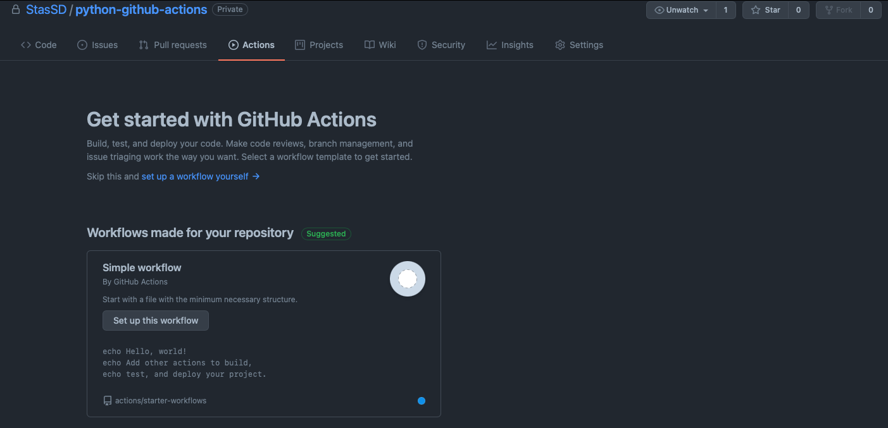

# About

The purpose of this article is to provide a handy and quick reference to general usage of **GitHub actions**, what it is and how one could implement them in their own project, as well as writing your own actions and customizing them. The customization will be illustrated by a simple example where we will automate testing in simple python script.

# Table of contents
* [What are GitHub actions?](#What-are-GitHub-actions?)
* How to implement your own workflow
* Where to look for references

## What are GitHub actions?

Even if you are experienced git user who knows tons of git workflows and best practices, you still might not even heard of some amazing features the GitHub platform itself has to offer. GitHub action is one such thing.

Basically **GitHub actions** is a feature which allows to configure your GH repository to automatically do some stuff depending on how you configure it. You write a few configuration files with commands specifying the settings for a remote machine that will run your application. You can also tell github to automatically do launch some stuff on a remote machine whenever some event happens, for instance, imagine you have some tests in your repository and you want every commit from your collaborators to pass the tests. You can tell github to run those tests whenever someone pushes to the repository.

By navigation to `actions` tab in your github repository you will see the following:




We will now move on to writing your own workflow.

## How to implement your own workflow

A workflow in github actions is basically a list of commands that you write to set up the remote machine on github to run in the way you want to. 


1) First, we create a `.github/workflows` directory in our git repository. You can do it in github or in your local repository, and then push it to remote github repo.
2) Then we need to create `.yml` file in `.github/workflows`. This will contain all of the commands we are going to write. You can name it whatever you like, on our case, this will simply be `main.yml`
3)

Unfortunately, after completing first tutorials one might not get the idea on how to put the gained knowledge into practice. If you have trouble figuring it out, then the next section is exactly what you need.

So, let's discuss everything step by step.

***Any git repository's structure using actions should contain the following:***

* A `.github` directory
* A `workflows` directory inside `.github` directory
* `.yml` file inside `workflows` directory

At this point familarity with everything above is assumed, please refer to the educational links above to get acquainted with basic GitHub actions setup

Now, let's discuss what every file does and how to configure them for out own needs.

### .github/workflows/.yml file

This file defines general settings for your workflow. A workflow in GitHub actions is a list of settings which define:
* Name of the workflow (example: "Autotesting")
* Workflow jobs. These are some sort of a functions in any program, aimed at performing some particular tasks.
* Steps which should be performed in the job. Treat them simply as commands inside of a function (example: install python, echo "Hello world", etc)

Let's create our main.yml file which sets our actions for automatic testing.

**main.yml**
```yml

name: A workflow for running tests on application # Name for our workflow
on: push # Make it run whenever someone pushes to repository

jobs: 
  tests:
    name: Unit tests action # Name of our build. For now let's stick only to single build
    runs-on: macos-latest # State which OS should be used for running your action
    steps: # Steps for the action
      - uses: actions/checkout@v1 # This is mandatory action, it 
                                  # is an action that checks out your
                                  # repository and downloads it to the runner,
                                  # allowing you to run actions against your code
                                  # otherwise your repository will not be cloned to
                                  # the remote machine running the action
      - name: setup python # Install python interpreter on our machine # this is another step
        uses: actions/setup-python@v2
        with:
          python-version: 3.8 # Specify the version
      - name: execute py script # Execute the script which containes python tests
        run: python tests.py

```

Several things should be noted:
* The `run` step is what actually we needed to add to our settings so we could run whatever we want remotely
* In order to run, for example, python script, you first need to install an interpreter for it, likewise, you would need to do install many dependencies for your other applicatioins, like `cmake`
for building `C++` projects, or `arm-none-eabi-gcc` for embedded development. For this you use actions already created by other GitHub users. You can find them [here](https://github.com/marketplace?type=actions) by typing in search field what should be installed in order for your action to run. In our case, we used `actions/setup-python@v2` action for installing python interpreter on the machine so it could run the tests script.
* We specified the `tests.py` file that should be run, therefore, it must exist inside the repository.

### Running the action

Now lets create the test.py file which contains the following:

```python

def test_sum():
    input = [1, 2, 3]
    output = 6
    assert(sum(input) == output)

test_sum()

```

Now we are going to commit the file and upload it to github repo.